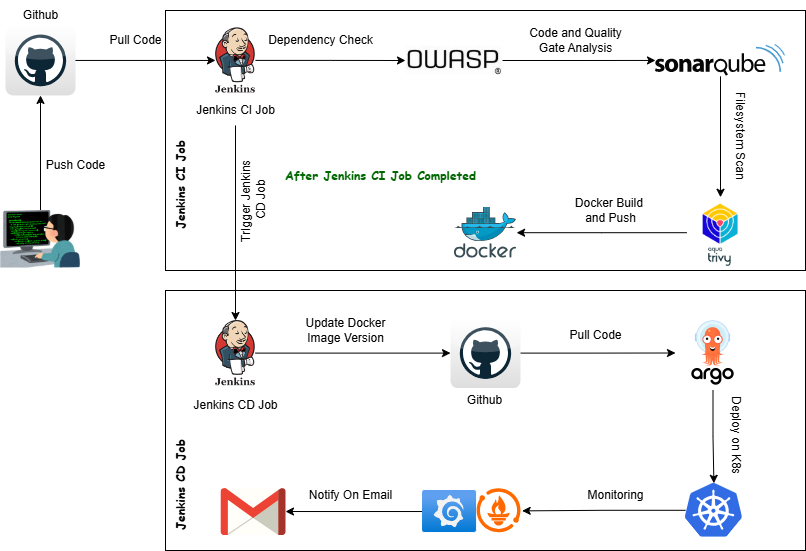

# Meet

Meet (Our Meet) is a web-based video conferencing service that allows users in different locations to hold real-time face-to-face meetings, free of cost. It is ideal for various use cases such as company meetings, job training sessions, or addressing board members.

## Features

- **Join Meet**: Easily join an existing meeting with a provided link or code.
- **Create Meet**: Host your own meeting and invite participants.
- **Audio Controls**: Mute and unmute your microphone during the meeting.
- **Video Controls**: Turn your camera on or off as needed.
- **In-Call Chatting**: Communicate with participants via text chat during the meeting.
- **Link Share**: Share the meeting link with others to invite them to join.
- **Meet Code Share**: Provide a unique meeting code for participants to join.
- **Participants List**: View a list of all participants in the meeting.
- **Leave Meet**: Exit the meeting when you are done.

---
## Meet Project End to End Implementation

In this demo, we will deploy a fully functional Meet Application on an EKS cluster.

---
Project Deployment Flow:

---

## Tech Stack Used in this Project
- Github (Code)
- Docker (Containerization)
- Jenkins (CI)
- OWAP (Dependency Check)
- Sonar Qube (Code Analysis)
- Trivy (FileSystem Scan)
- Argo CD (CD)
- AWS EKS (Orchestration)
- Terraform (Infrastructure Provisioning)
- Ansible (Configuration Management)
- Helm (Monitoring using Grafana and Prometheus)

---

