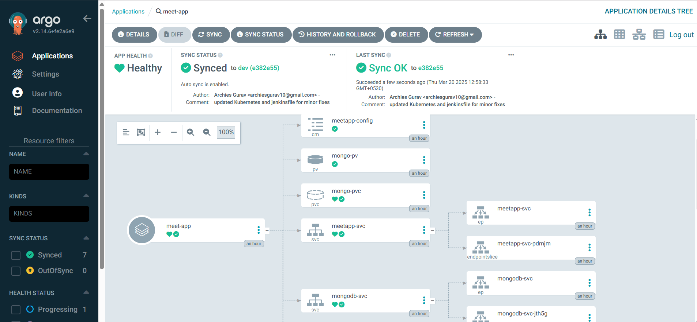
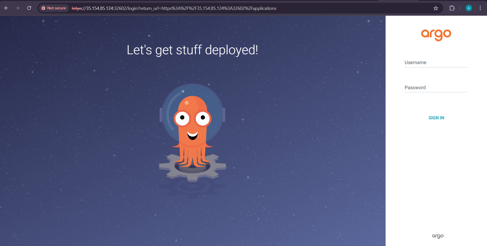
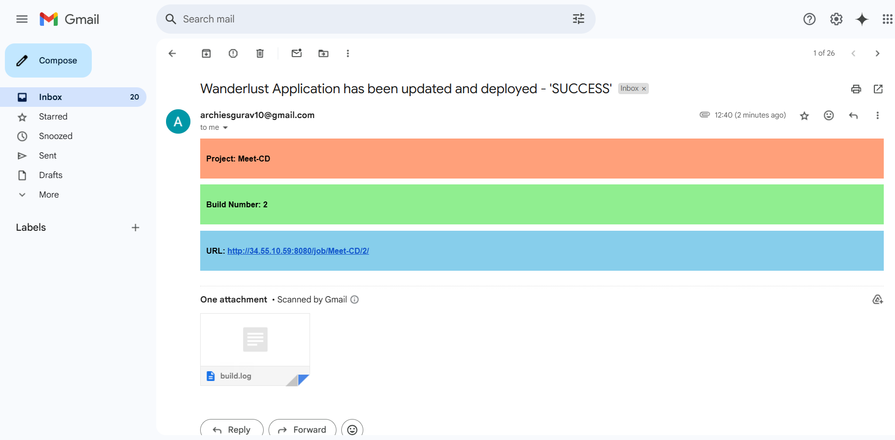

# Meet

Meet is a web-based video conferencing service that allows users to hold real-time face-to-face meetings for free. It is ideal for various use cases such as company meetings, job training sessions, or board member discussions.


## Features

- **Join Meet**: Easily join an existing meeting using a provided link or code.
- **Create Meet**: Host your own meeting and invite participants.
- **Audio Controls**: Mute and unmute your microphone during the meeting.
- **Video Controls**: Turn your camera on or off as needed.
- **In-Call Chatting**: Communicate with participants via text chat during the meeting.
- **Link Sharing**: Share the meeting link with others for easy access.
- **Meet Code Sharing**: Provide a unique meeting code for participants to join.
- **Participants List**: View a list of all attendees.
- **Leave Meet**: Exit the meeting when you are done.

---

## Meet Project End-to-End Implementation

In this demo, we will deploy a fully functional Meet application on an AWS EKS (Elastic Kubernetes Service) cluster.

### **Project Deployment Flow:**

## Tech Stack Used in this Project

The following technologies are used in this project for deployment, monitoring, and management:

- **GitHub** (Source Code Management)
- **Docker** (Containerization)
- **Jenkins** (Continuous Integration - CI)
- **OWASP Dependency Check** (Security Scanning)
- **SonarQube** (Code Quality Analysis)
- **Trivy** (File System Security Scan)
- **Argo CD** (Continuous Deployment - CD)
- **AWS EKS** (Kubernetes Orchestration)
- **Terraform** (Infrastructure Provisioning)
- **Ansible** (Configuration Management)
- **Helm** (Monitoring using Grafana and Prometheus)

---

## CI/CD Pipelines

### **CI Pipeline (Build & Push)**


### **CD Pipeline (Application Deployment)**


### **Argo CD Application Deployment on EKS**



---

## Prerequisites to Implement This Project

### **Why Use Google Cloud?**

Google Cloud offers a **$300 free credit** for **three months**, making it an excellent choice for provisioning heavy instances without incurring costs. This allows us to set up and test our EKS infrastructure efficiently.

### **Master Node Setup**

> **Note:**
> This instance will act as the master node and will be used for all EKS cluster operations using Kubectl. It will also be used for Jenkins and Argo CD operations.

1. **Create a new Ubuntu 22.04 LTS instance on Google Cloud**

   - Machine Type: `e2-standard-2`
   - RAM: `8GB`
   - vCPUs: `2`
   - Storage: `30GB`
2. **Open the required ports in firewall rules for the master node**
   
3. **Add Public Key to the instance before creation**

   - Navigate to **Security > Scroll Down to Manage Access > Add Key**
   - Paste the Public Key and save it

### **Ansible Provisioner VM Setup**

> **Note:**
> This instance is used only for configuration and package installations via Ansible. It is not recommended to run any other workloads on this instance.

1. **Create a new Ubuntu 22.04 LTS instance on Google Cloud**

   - Machine Type: `e2-medium`
   - RAM: `4GB`
   - vCPUs: `2`
   - Storage: `10GB`
2. **Install Ansible on the instance**

   - Use the following script to install Ansible:

```bash
#!/bin/bash

# Exit immediately if a command fails
set -e

run_silent() {
    "$@" >/dev/null 2>&1
}

echo "🔄 Updating package lists..."
run_silent sudo apt update -y

echo "📦 Installing required dependencies..."
run_silent sudo apt install -y software-properties-common

echo "➕ Adding Ansible PPA repository..."
run_silent sudo apt-add-repository --yes --update ppa:ansible/ansible

echo "🚀 Installing Ansible..."
run_silent sudo apt install -y ansible

# Verify installation
echo "✅ Ansible installed successfully!"
ansible --version
```

3. **Clone the Meet repository**

```bash
git clone https://github.com/rcheeez/meet.git
```

4. **Create an SSH key pair for secure remote access**

To enable Ansible to connect and configure the master instance properly, generate an SSH key pair and add the public key to the master instance.

```bash
cd ~/.ssh
ssh-keygen
```

This creates an SSH key pair. The **public key must be added to the master node** to allow secure connections.

5. **Configure the Ansible hosts file**

   - Open the hosts file:

   ```bash
   sudo vim /etc/ansible/hosts
   ```

   - Add the following configuration:

   ```ini
   [master]
   master_server ansible_host=<public-ip-address>

   [master:vars]
   ansible_python_interpreter=/usr/bin/python3
   ansible_user=<vm-username>
   ansible_ssh_private_key_file=/home/<vm-username>/.ssh/<key-name>
   ```
6. **Set proper permissions for the private key**

```bash
sudo chmod 600 /home/<vm-username>/.ssh/<key-name>
```

7. **Install the required Ansible collections**

```bash
ansible-galaxy collection install community.docker
```

8. **Run the Ansible playbook to configure the master node**

```bash
ansible-playbook -i /etc/ansible/hosts master_server_tools_play.yml
```

> **NOTE**
> Make sure the Master Node is up and running and also make sure the Public key is added to the Master Node.

This will setup all the configuration on the Master Node.

## 🌍 Terraform Configuration for EKS on Google Cloud Shell

We will use **Google Cloud Shell** to provision our **AWS EKS** infrastructure using Terraform. Since **Terraform** is already installed in **Google Cloud Shell**, we can directly execute our infrastructure provisioning commands without any additional setup.
This approach eliminates the need for external applications and leverages **Google's free cloud credits** for cost-effective provisioning.

---

### 🛠 Steps to Set Up Terraform on Google Cloud Shell

#### 1️⃣ **Launch Google Cloud Shell**

- Open **[Google Cloud Console](https://console.cloud.google.com/)**
- Click on **Activate Cloud Shell**

#### 2️⃣ **Clone the Terraform Repository**

```bash
git clone https://github.com/rcheeez/meet.git
cd meet/terraform/
```

#### 3️⃣ **Initialize Terraform**

```bash
terraform init
```

#### 4️⃣ **Apply Terraform Configuration to Provision EKS Cluster**

```bash
terraform plan
terraform apply --auto-approve
```

---


---

## 🚀 Setting Up Jenkins & Installing Required Plugins

### 1️⃣ Install Required Plugins

- Navigate to **Jenkins > Manage Jenkins > Plugins > Available Plugins**
- Install the following plugins:

  1. **OWASP Dependency Check**
  2. **Docker Pipeline**
  3. **Pipeline: Stage View Plugin**
  4. **SonarQube Scanner**
- After installing these plugins, **restart Jenkins** to apply the changes.

---

## ⚙️ Setting Up Tools

Navigate to **Jenkins > Manage Jenkins > Tools** and configure the required tools:

### 1️⃣ Add **SonarQube Scanner**

- **Name:** `sonarqube`
- **Installation:** Install Automatically

### 2️⃣ Add **OWASP Dependency Check**

- **Name:** `OWASP`
- **Installation:** Install Automatically from GitHub

### 3️⃣ Add **Docker**

- **Name:** `docker`
- **Installation:** Install Automatically from Docker (latest version)

---

## 🔧 Configuring SonarQube for Jenkins Integration

After adding the required tools, we need to **integrate SonarQube with Jenkins** by creating an authentication token and setting up a webhook for automated analysis.

### 1️⃣ **Generating a SonarQube Token for Jenkins**

- Navigate to **SonarQube > User > Security > Tokens**
- Click on **Generate Token** and provide a name (e.g., `jenkins-sonar-token`)
- Copy the generated token and save it securely

### 2️⃣ **Adding SonarQube Token in Jenkins**

- Navigate to **Jenkins > Manage Jenkins > Credentials**
- Add a new credential with:
  - **ID:** `sonar-token`
  - **Type:** **Secret Text**
  - **Secret:** *Paste the copied SonarQube token*

_(Refer to the next section for detailed steps on adding credentials in Jenkins.)_

### 3️⃣ **Setting Up a SonarQube Webhook for Jenkins**

- Login to **SonarQube** and navigate to **Administration > Webhooks**
- Click **Create** and configure the webhook to point to your **Jenkins server URL**
- This enables automatic triggering of **SonarQube analysis** after each Jenkins build

---

## 🔐 Configuring Credentials for the Pipeline

Navigate to **Jenkins > Manage Jenkins > Credentials > Credentials Provider** and add the following credentials:

### 1️⃣ **Git Credentials**

- **ID:** `git-creds`
- **Description:** Git Credentials
- **Type:** Username with Password
- **Username:** *Your Git Username*
- **Password:** *Your Git Personal Access Token*

### 2️⃣ **Docker Credentials**

- **ID:** `docker-creds`
- **Description:** Docker Credentials
- **Type:** Username with Password
- **Username:** *Your Docker Hub Username*
- **Password:** *Your Docker Personal Access Token*

### 3️⃣ **SonarQube Token**

- **ID:** `sonar-token`
- **Description:** SonarQube Token
- **Type:** Secret Text
- **Secret:** *Your SonarQube API Token*

### 4️⃣ **Gmail Credentials**

- **ID:** `gmail-creds`
- **Description:** Gmail Credentials
- **Type:** Username with Password
- **Username:** *Your Gmail Email*
- **Password:** *Your Google Account App Password*

---

### ✅ **Final Step**

📌 **Ensure all credentials are added correctly as shown in the reference image.**


---

## Configuring the System in Jenkins

After setting up the credentials, follow these steps to configure the system in Jenkins:

### 1️⃣ Access Jenkins System Configuration

- Navigate to **Jenkins > Manage Jenkins > System**
- Click on **Configure System**

### 2️⃣ Set System Email Address

- Under **Jenkins Location**, set the **System E-mail address** to your Gmail account.

### 3️⃣ Configure SonarQube Servers

- Add a new **SonarQube Server** entry.
- Provide a **name** for the server, enter the **server URL**, and set up authentication credentials.

### 4️⃣ Set Up Global Trusted Pipeline Libraries

- Add a new **Shared Library** entry.
- Provide:
  - Library **name**
  - Git **repository URL**
  - Project repository **branch name**
  - Credentials (if the **Jenkins Shared Library** repository is private)

### 5️⃣ Configure Git Plugin

- Locate **Git Plugin settings** in the configuration.
- Fill in the following fields:
  - **Git Global Config user.name** → Enter your Git username
  - **Git Global Config user.email** → Enter your Git email

### 6️⃣ Set Up Email Notifications

**🔹 Extended Email Notification:**

- Configure the **SMTP server** and **port**.
- Add authentication **credentials** and enable **SSL**.

**🔹 Email Notification:**

- Configure the **SMTP server**, **port**, and **credentials**.
- Enable **SSL**.
- Test the configuration by sending a **test email** to verify the setup.

---

## 🚀 Creating CI and CD Jenkins Pipelines

After configuring the system, follow these steps to create **CI and CD Jenkins pipelines** for the Meet application.

---

### 📌 1️⃣ Creating the Jenkins CI Pipeline (Meet-CI)

#### **Step 1: Create a New Jenkins Pipeline Job**

- Open **Jenkins Dashboard** → Click on **New Item**
- Enter **Job Name**: `Meet-CI`
- Select **Pipeline** as the project type
- Click **OK** to create the job

#### **Step 2: Configure the Pipeline**

- Scroll down to the **Pipeline** section
- Under **Definition**, choose **Pipeline script from SCM****Option 1: Using SCM (Recommended)**
  - **SCM**: Select **Git**
  - **Repository URL**: Add your GitHub repository URL
  - **Credentials**: Add Git credentials if required(if repository is private)
  - **Branch**: Select the branch where the Jenkinsfile exists (e.g., `main`)
  - **Script Path**: Set it as `Jenkinsfile`

    **Option 2: Manually Copying the Jenkinsfile**

    - Select **Pipeline script**
    - Manually paste the contents of `Jenkinsfile` from the `gitops` folder

🖼️ **Screenshot: Jenkins CI Pipeline Configuration**


---

### 📌 2️⃣ Creating the Jenkins CD Pipeline (Meet-CD)

#### **Step 1: Create a New Jenkins Pipeline Job**

- Open **Jenkins Dashboard** → Click on **New Item**
- Enter **Job Name**: `Meet-CD`
- Select **Pipeline** as the project type
- Click **OK** to create the job

#### **Step 2: Configure the Pipeline**

- Scroll down to the **Pipeline** section
- Under **Definition**, choose one of the two options:

  **Option 1: Using SCM (Recommended)**

  - **SCM**: Select **Git**
  - **Repository URL**: Add your GitHub repository URL
  - **Credentials**: Add Git credentials if required (if repostiory is private)
  - **Branch**: Select the branch where the Jenkinsfile exists (e.g., `main`)
  - **Script Path**: Set it as `gitops/Jenkinsfile`

  **Option 2: Manually Copying the Jenkinsfile**

  - Select **Pipeline script**
  - Manually paste the contents of `Jenkinsfile` from the `gitops` folder
- Click **Save**

🖼️ **Screenshot: Jenkins CD Pipeline Configuration**


---

🎯 **Now your CI/CD pipelines are ready!**

- **Meet-CI** will handle **building, testing, and pushing images**
- **Meet-CD** will handle **deployments via ArgoCD**


---

# 🚀 Running the CI/CD Pipelines

Now that Jenkins is set up, let's run the pipelines.

### 1️⃣ **Run the CI Pipeline**

- Navigate to **Jenkins > Meet-CI**
- Click **Build Now**
- Monitor the pipeline execution to ensure successful build, test, and push steps

### 2️⃣ **Run the CD Pipeline**

- Navigate to **Jenkins > Meet-CD**
- Click **Build Now**
- This will trigger the deployment process using ArgoCD

Once the pipelines have successfully run, we can now **set up ArgoCD on EKS** for automated deployments.

---

# 🚀 Setting Up ArgoCD on EKS for CI/CD Deployment

Before deploying applications via ArgoCD, we need to **connect `kubectl` to our EKS cluster** and **install ArgoCD**.

---

## 🔗 Connecting `kubectl` to EKS Cluster

1️⃣ **Ensure AWS CLI is configured**
   Before running the following command, **make sure you have configured AWS CLI (`aws configure`)**. Otherwise, the connection will fail.

2️⃣ **Connect `kubectl` to the EKS Cluster**

```bash
   aws eks update-kubeconfig --region ap-south-1 --name meet-cluster
```

   This command connects your **EKS cluster** to `kubectl`.

---

## 🛠 Installing ArgoCD on EKS

### 1️⃣ **Create ArgoCD Namespace**

```bash
kubectl create ns argocd
```

### 2️⃣ **Apply ArgoCD Manifest**

```bash
kubectl apply -n argocd -f https://raw.githubusercontent.com/argoproj/argo-cd/stable/manifests/install.yaml
```

### 3️⃣ **Verify ArgoCD Installation**

```bash
kubectl get pods -n argocd
```

Ensure that all **ArgoCD pods are running**.

---

## ⚙️ Checking ArgoCD Services

```bash
kubectl get svc -n argocd
```

This will list all the services running under the `argocd` namespace.

### **Change ArgoCD Service Type to NodePort**

By default, ArgoCD runs as a `ClusterIP` service. We need to change it to `NodePort` for external access.

```bash
kubectl patch svc argocd-server -n argocd -p '{"spec": {"type": "NodePort"}}'
```

### **Confirm the Service is Patched**

```bash
kubectl get svc -n argocd
```

✅ Ensure the `argocd-server` service is now of type **NodePort**.

---

## 🌐 Accessing ArgoCD UI

1️⃣ **Find Your Public EKS Worker Node IP**
2️⃣ Open the ArgoCD UI in a browser using:

```
   <public-eks-worker-ip>:<node-port>
```

3️⃣ Click **Advanced** and proceed.



---

## 🔑 Fetching Initial Admin Password

```bash
kubectl -n argocd get secret argocd-initial-admin-secret -o jsonpath="{.data.password}" | base64 -d; echo
```

Copy the **decoded password** and use it to log in to ArgoCD.

## 🏗 Updating Admin Password

1️⃣ **Log in to ArgoCD UI**
2️⃣ Go to **User Info > Update Password**
3️⃣ Set a **new secure password**.

---

## 🔗 Connecting Git Repository to ArgoCD

1️⃣ **Go to** **Repositories** section in ArgoCD UI2️⃣ Click **Connect Repository**3️⃣ Choose **Git** as repository type4️⃣ Enter the **Repository URL** and select the **Branch**5️⃣ Click **Connect**

> **📝 Note:** The connection **must be successful** before proceeding.


---

## 🔐 Logging in to ArgoCD via CLI

📌 The **ArgoCD CLI** is already installed using **Ansible** on the Jenkins Master machine.

1️⃣ **Login to ArgoCD CLI**

```bash
argocd login <eks-worker-public-ip>:<node-port> --username admin
```

2️⃣ **Enter the password** fetched earlier.

✅ You are now logged in to ArgoCD via CLI.


---

## 📌 Checking Available Clusters in ArgoCD

```bash
argocd cluster list
```

## 🔍 Finding Your EKS Cluster Name

```bash
kubectl config get-contexts
```

## 🔗 Adding EKS Cluster to ArgoCD

```bash
argocd cluster add arn:aws:eks:ap-south-1:034362041947:cluster/meet-cluster --name meet-cluster
```

---

### 🎯 **Verify Cluster in ArgoCD UI**

1️⃣ Go to **Settings → Clusters**
2️⃣ Ensure that the EKS cluster is **successfully added**

---

## 🚀 Deploying an Application in ArgoCD

1️⃣ **Go to** **Applications** → **New App**
2️⃣ **Fill in the required details**
3️⃣ **Enable "Auto-Create Namespace"**
4️⃣ **Set the Application Name same as Namespace**
5️⃣ Click **Create**

Here's the improved version with better readability and clarity:


✅ **Your ArgoCD deployment is now ready!** 🎉

---


## 🔍 Verify Deployment and Access the Application

### 1️⃣ **Check the Deployment Status from Master Instance**

Run the following command to check the status of your services and deployments:

```bash
kubectl get all -n meetapp
```

This will display the **pods, services, and deployments** running inside the `meetapp` namespace.

### 2️⃣ **Find the Service NodePort**

Look for the **NodePort** assigned to your service in the output. For example:


Here, the **NodePort is `31818`**.

### 3️⃣ **Access the Application in Browser**

Open your browser and visit:

```
http://<public-eks-worker-ip>:31818
```

📌 **Replace `<public-eks-worker-ip>` with your actual worker node’s public IP.**

---

🚀 **Your application has been successfully deployed and is now accessible!** 🎯

---

### 🌐 **Access the Deployed Application**

You can now open the application in your browser using the assigned **NodePort**.


📌 **Ensure that you are using the correct public IP of your EKS worker node.**

---

### 📩 **Deployment Success Notification**

A **success email notification** has also been sent to the email address configured in the Jenkins pipeline.



✅ **This confirms that the CI/CD pipeline has successfully built and deployed the application!** 🚀

# 📊 **Monitoring EKS Cluster & Workloads with Prometheus & Grafana (via HELM)**

To effectively **monitor your EKS cluster, Kubernetes components, and workloads**, we will set up **Prometheus** and **Grafana** using HELM.

---

## 🛠 **Installing HELM on the Master Machine**

1️⃣ **Download and Install HELM**

```bash
curl -fsSL -o get_helm.sh https://raw.githubusercontent.com/helm/helm/main/scripts/get-helm-3
chmod 700 get_helm.sh
./get_helm.sh
```

2️⃣ **Add HELM Chart Repositories**

```bash
helm repo add stable https://charts.helm.sh/stable
helm repo add prometheus-community https://prometheus-community.github.io/helm-charts
```

✅ This adds the required repositories for installing **Prometheus** and **Grafana**.

---

## 📌 **Deploying Prometheus & Grafana on EKS**

1️⃣ **Create a Namespace for Prometheus**

```bash
kubectl create ns prometheus
```

2️⃣ **Install Prometheus and Grafana using HELM**

```bash
helm install stable prometheus-community/kube-prometheus-stack -n prometheus
```

✅ This installs **Prometheus for monitoring** and **Grafana for visualization**.

3️⃣ **Check Prometheus Services**

```bash
kubectl get svc -n prometheus
```

---

## 🌍 **Exposing Prometheus & Grafana to External Access**

By default, **Prometheus and Grafana** are only accessible within the cluster.
We need to **change their services to NodePort** to make them accessible externally.

1️⃣ **Expose Prometheus to External Access**

```bash
kubectl edit svc stable-kube-prometheus-sta-prometheus -n prometheus
```

🔹 **Modify the `type: ClusterIP` to `type: NodePort`**
🔹 Save and exit the editor

2️⃣ **Verify Prometheus Service is Exposed**

```bash
kubectl get svc -n prometheus
```

3️⃣ **Expose Grafana to External Access**

```bash
kubectl edit svc stable-grafana -n prometheus
```

🔹 **Modify the `type: ClusterIP` to `type: NodePort`**
🔹 Save and exit the editor

4️⃣ **Verify Grafana Service is Exposed**

```bash
kubectl get svc -n prometheus
```

---

## 🔑 **Accessing Grafana Dashboard**

1️⃣ **Get Grafana Admin Password**

```bash
kubectl get secret --namespace prometheus stable-grafana -o jsonpath="{.data.admin-password}" | base64 --decode ; echo
```

📌 The **default username** is `admin`. Use the retrieved password to log in.

2️⃣ **Open Grafana in Your Browser**
Use the **EKS worker node’s public IP** and the **Grafana NodePort** to access it.

---

## 📊 **Grafana Dashboards**

Once logged in, explore the **pre-configured dashboards** to monitor your Kubernetes cluster!


---

## 🧹 **Cleaning Up the Infrastructure**

When you're done, **delete the EKS infrastructure** and **remove the GCP instances** to avoid unnecessary costs.

```bash
terraform destroy --auto-approve
```

✅ **This command will remove all AWS EKS resources.**
✅ **Manually delete the two instances from GCP.**

---
